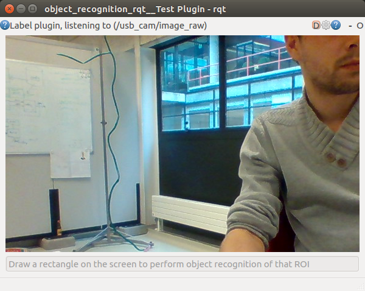
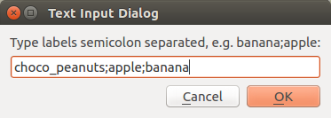
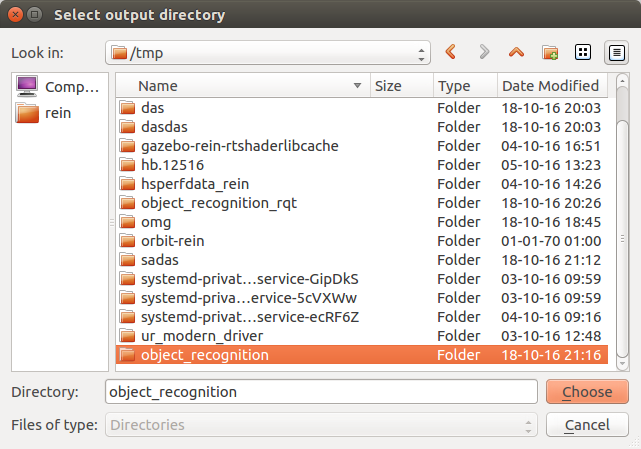

# image_recognition_rqt

Contains rqt plugins for image recognition 

## Test plugin

RQT plugin to test servers that expose the service https://github.com/tue-robotics/image_recognition/image_recognition_msgs

### How to 

Start the rqt plugin stand alone (if this does not work, try a `rqt --force-rediscover`):

    rosrun image_recognition_rqt test_gui # Calls a rqt -s image_recognition_rqt.test.TestPlugin
    
Select a rostopic of type `sensor_msgs/Image` and a service of type `image_recognition_msgs/Recognize` with use of the configuration button in the menu-bar (gear wheel icon):

If you do not have any available topic, try to use your webcam with use of the usb_cam node (http://wiki.ros.org/usb_cam), you can start this node with:

    rosrun usb_cam usb_cam_node # This step is optional ofcourse
    
Once you have an image stream in your GUI, you can draw a rectangle in the image feed, this ROI will be send to the object recognition srv.

## Label plugin

This RQT plugin (http://wiki.ros.org/rqt) enables easy labeling of objects using a graphical GUI. The end result will be a folder with label subdirs that contain image segments of the specified label, e.g. `/tmp/object_recognition`:

    /tmp/object_recognition/:
    drwxrwxr-x 2 rein rein 4,0K okt 18 21:22 apple
    drwxrwxr-x 2 rein rein 4,0K okt 18 21:22 banana
    drwxrwxr-x 2 rein rein 4,0K okt 18 21:22 choco_peanuts

    /tmp/object_recognition/apple:
    -rw-rw-r-- 1 rein rein 14K okt 18 21:22 2016-10-18-21-22-29.jpg
    ...

    /tmp/object_recognition/banana:
    -rw-rw-r-- 1 rein rein 16K okt 18 21:22 2016-10-18-21-22-37.jpg
    ...

    /tmp/object_recognition/choco_peanuts:
    -rw-rw-r-- 1 rein rein 8,6K okt 18 21:22 2016-10-18-21-22-43.jpg
    ...
    
This folder can be used for training for example a neural network. A Tensorflow example can be found here: https://github.com/tensorflow/tensorflow/blob/master/tensorflow/examples/image_retraining/retrain.py

### How to 

Start the rqt plugin stand alone (if this does not work, try a `rqt --force-rediscover`):

    rosrun image_recognition_rqt label_gui # Calls a rqt -s image_recognition_rqt.label.LabelPlugin
    
Select a rostopic of type `sensor_msgs/Image` with use of the configuration button in the menu-bar (gear wheel icon):

If you do not have any available topic, try to use your webcam with use of the usb_cam node (http://wiki.ros.org/usb_cam), you can start this node with:

    rosrun usb_cam usb_cam_node # This step is optional ofcourse
    
Once you have an image stream in your GUI, you can set the labels of your different objects with use of the 'Edit labels' button in the bottom-left corner:

It is also possible to specify your output path with use of the 'Edit path' button in the bottom-left corner:

All these settings will be stored in the rqt config. Once you have set everything up, you can start labeling by drawing a rectangle in the image stream:

A dialog will prompt that lets you select your object label and an image will be stored in the specified directory. If you want to capture more images for your object, just click the 'Save another one' button. If you want to save an image of a new object, redraw a rectangle and repeat the process.

Happy labeling :)

    

